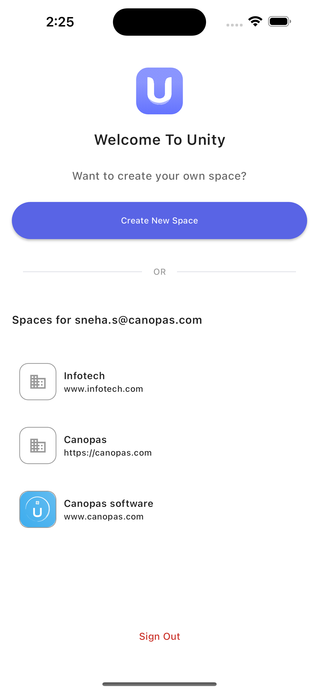
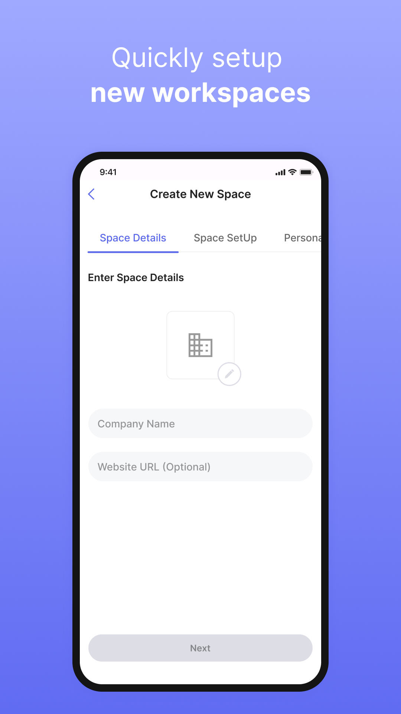
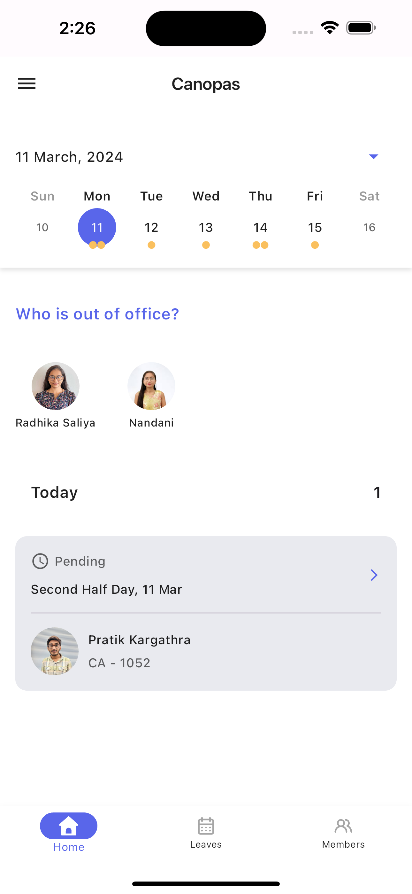
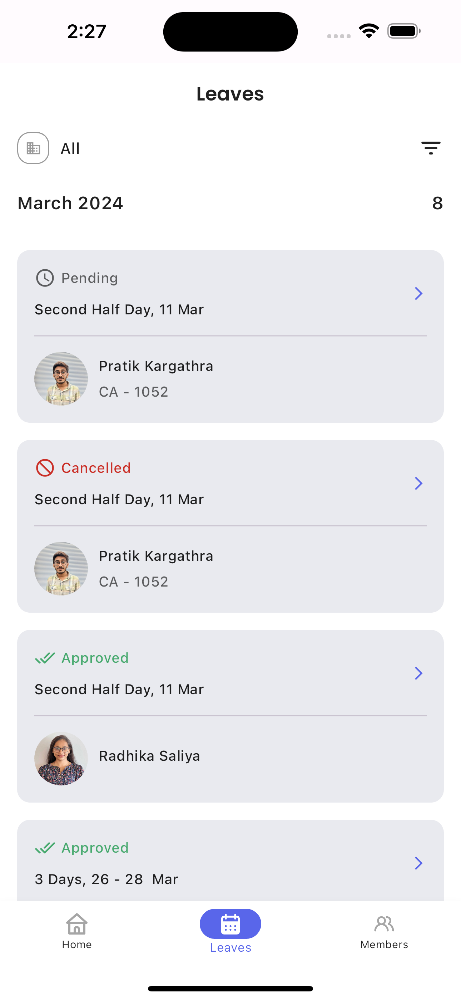
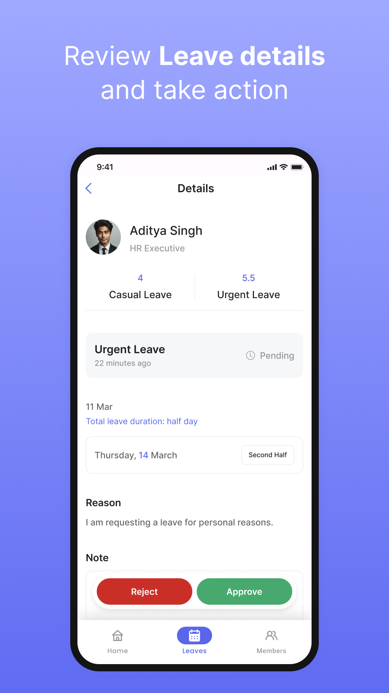
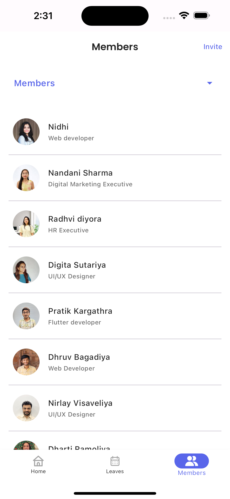

<p align="center"> <a href="https://canopas.com/contact"></a></p>

# Unity 

## Leave & Employee Management - Smarter HR Solution!

Welcome to Unity, your all-in-one solution for seamless leave and employee management within your organizations!

---- Cover image----

## Download App

</img> </img>

## Features 🌟🌟

- **Multi-Platform support**🌐: Unity gracefully adapts to your preferred platform – Android, iOS, or web, delivering a unified and professional leave management solution.
- **Space Management**🗂️: Create and manage multiple spaces effortlessly, allowing for organized leave tracking across different spaces.
- **Role-based access**🔒: Assign different roles to users, including Employees, HR and Admin, ensuring secure and efficient leave management with the right permissions.
- **Real-time Updates**🚀: Stay informed with real-time updates on leave request, approvals, and rejections, providing a transparent and efficient leave management.
- **Team Coordination**👥: Enhance team coordination by allowing users to view coworkers on leave, promoting a collaborative and informed workplace environment
- **Leave Analytics**📊: Keep a record of yearly paid leaves and overall counts.

## Screenshots

<table>
  <tr>
  <th width="32%" >Create/Join Space</th>
  <th  width="32%" >Create Space</th>
   <th  width="32%" >Admin Dashboard Screen</th>
  </tr>
    <tr>
  <td></td>
  <td>  </td>
  <td>  </td>
  </tr>  
</table>

<table>
  <tr>
  <th width="32%" > Admin Leaves Screen</th>
  <th  width="32%" >Leave Approval</th>
   <th  width="32%" >Employees Screen</th>
  </tr>
    <tr>
  <td></td>
  <td>  </td>
  <td>  </td>
  </tr>  
</table>


## Getting Stated

### Using the App

To get started using Unity, refer to the User Guide for detailed information on how to navigate, create spaces, add employees, and manage leaves efficiently.

> **Note**: This project use 
> For project setup instructions, please refer to the Wiki section


## What's next?

- 

## Support 🤝

We welcome and appreciate any suggestions you may have for improvement. For bugs, questions and discussions please use the Github Issues.


##  Created & Maintained By

**canopas_unity** is owned and maintained by the [Canopas team](https://canopas.com/).
You can follow them on Twitter at [@canopassoftware](https://twitter.com/canopassoftware) for
project updates and releases. If you are interested in building apps or designing products, please let us know. We'd love to hear from you!

<a href="https://canopas.com/contact"></a>

## Licence  📄

**Unity** is licensed under the Apache License, Version 2.0.

```
Copyright 2024 Canopas Software LLP

Licensed under the Apache License, Version 2.0 (the "License");
You won't be using this file except in compliance with the License.
You may obtain a copy of the License at

   http://www.apache.org/licenses/LICENSE-2.0

Unless required by applicable law or agreed to in writing, software
distributed under the License is distributed on an "AS IS" BASIS,
WITHOUT WARRANTIES OR CONDITIONS OF ANY KIND, either express or implied.
See the License for the specific language governing permissions and
limitations under the License.
```

