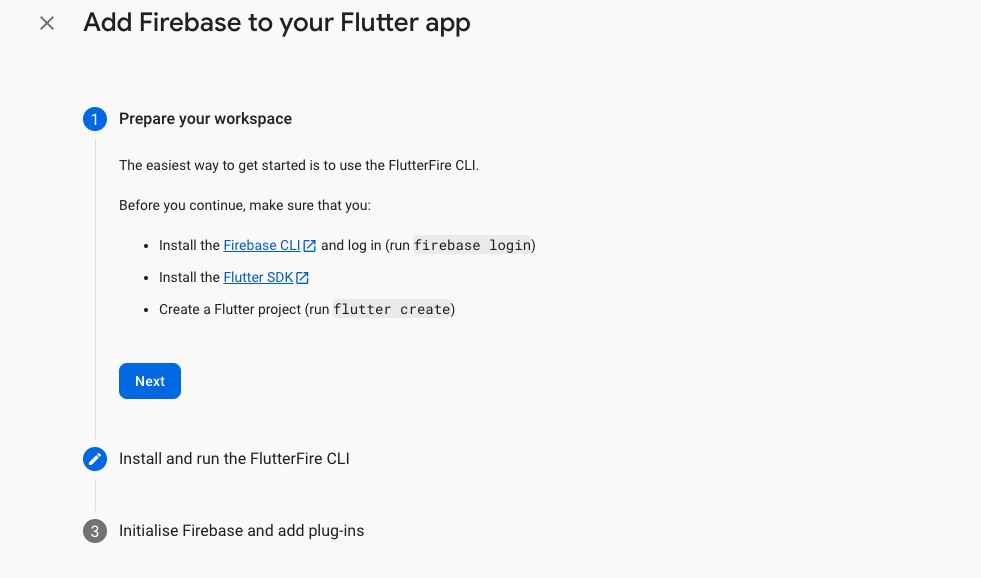
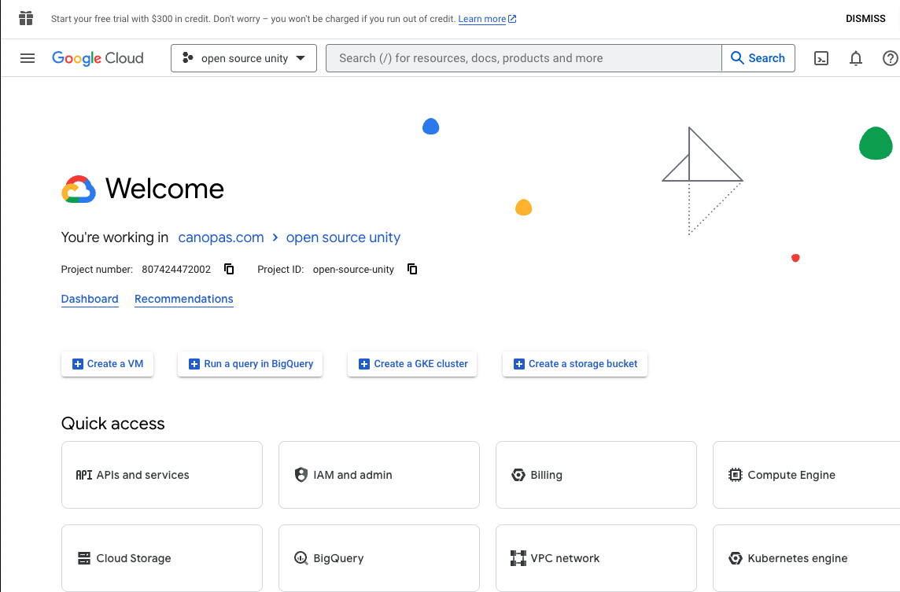

<p align="center"> <a href="https://canopas.com/contact"></a></p>

## Unity, Leave & Employee Management - Smarter HR Solution!

Welcome to Unity, your all-in-one solution for seamless leave and employee management within your organizations!

It is an open-source cross-platform Leave management app written in Dart using Flutter.

---- Cover image----

## Download App

</img> </img>

## Features 🌟🌟

- **Multi-Platform support**🌐: Unity gracefully adapts to your preferred platform – Android, iOS, or web, delivering a unified and professional leave management solution.
  
- **Space Management**🗂️: Create and manage multiple spaces effortlessly, allowing for organized leave tracking across different spaces.
  
- **Role-based access**🔒: Assign different roles to users, including Employees, HR and Admin, ensuring secure and efficient leave management with the right permissions.
  
- **Real-time Updates**🚀: Stay informed with real-time updates on leave request, approvals, and rejections, providing a transparent and efficient leave management.
  
- **Team Coordination**👥: Enhance team coordination by allowing users to view coworkers on leave, promoting a collaborative and informed workplace environment
  
- **Leave Analytics**📊: Keep a record of yearly paid leaves and overall counts.

## Screenshots

<table>
  <tr>
  <th width="32%" >Create/Join Space</th>
  <th  width="32%" >Create Space</th>
   <th  width="32%" >Admin Dashboard Screen</th>
  </tr>
    <tr>
  <td></td>
  <td>  </td>
  <td>  </td>
  </tr>  
</table>

<table>
  <tr>
  <th width="32%" > Admin Leaves Screen</th>
  <th  width="32%" >Leave Approval</th>
   <th  width="32%" >Employees Screen</th>
  </tr>
    <tr>
  <td></td>
  <td>  </td>
  <td>  </td>
  </tr>  
</table>


## Getting Stated

### Using the App

<details>

<summary>User Guide</summary>

### Getting Started With Unity
Welcome to Unity, your all-in-one solution for seamless leave and employee management within your organizations.
Unity introduces three distinct roles: **Admin**, **HR**, and **Employee**. Let's guide you through the initial steps to ensure a smooth start.

#### Sign-in
- To get started with unity, signing in with Google or Apple

#### Create a new Space
- After signing in, you have a option to create a new space. By default, the creator is assigned as the **Admin** role, granting full access,including the ability to edit or remove the space if no longer needed.

#### Joining a Existing Space:
- If you've been invited to join a space, these invitations will be visible after signing in. Simply select the space to join it.
- Invited members are assigned the default role of **Employee**. The role can be edited later by admin after the user has joined the space.


### Admin Role:

As an Admin, you have the highest level of permissions, allowing you to:

#### * Create Spaces
- After Successful Sign in With Google or Apple.
- Navigate to Spaces screen.
- Click on **_Create New Space_**.
- Fill in the required details and confirm.

#### * Edit Space
- Click on **☰** button on the left side on Home screen.
- Click on **_Edit space_** to edit it.

#### * Manage Leave Request
- The home screen displays all pending leave requests.
- Review pending requests and approve or reject them. (Employee will receive notification mail for the leave approval/rejection)

#### * View Leave History
- Go to the **_Leaves_** Tab.
- Apply filters to view leaves of specific employees.
  (Can see all Details of the Leaves.)

#### * Manage Employees
- Go to **_Members_** tab
- Invite New Member,
    - To Invite new member, Click on **_Invite_** button.
    - Add Email of user and confirm.
      (User will receive invitation mail - planned.)
- For existing members,
    - Click on a specific employee to see detailed information.
    - You can _**Edit**_ or _**Deactivate**_ them.
      (After Deactivate user, User will lose access of the space.)

### HR Role

As an HR User, Your permissions are same as Admin including:

#### * Manage Employees
(Can't change Role of the employee)
#### * View Leave History
#### * Manage Leave Request
#### * Request Leave
- Go to Leaves Tab
- Click on **+** Button to apply leave.
  (Only Admin can review your leave request and approve/reject it.)

### Employee Role

As an Employee, you can:

#### * Request Leave
- Go to Leaves Tab.
- Click on **+** Button to apply leave.
  (Only Admin/HR can review your leave request and approve/reject it.)

#### * View Leave History
- Can see Leave Details of coworkers except reason .
- Can see only upcoming Leaves of coworkers.
  (Go to Members tab, Click on member and you can see upcoming leaves of the member.)

#### * Update Personal Information
- Click on **☰** button on the left side on Home screen.
- Click on **_Personal Details_** to Update it.
  (As an employee, you can't change your role within the organization.)

</details>

### Run locally
> **Note**: This project uses firebase realtime and firestore database and firebase authentication💥
 
<details>

<summary>Project Setup Instructions</summary>

## Set-up Guide

#### 1. [Flutter Environment Setup](https://docs.flutter.dev/get-started/install)
> **Note**: Flutter sdk version `'>=3.2.0 <4.0.0'` is recommended to run project.

#### 2. Clone the repo
```sh
$ git clone https://github.com/canopas/canopas-unity.git
```
#### 3. Rename the app Package Name
* Rename the app package name (because this can affect the Firebase).
* You can do it manually or using this package [Rename Package](https://pub.dev/packages/rename) or look at this [Stackoverflow Question](https://stackoverflow.com/questions/51534616/how-to-change-package-name-in-flutter).

#### 4. Setup the Firebase app
* You'll need to create a Firebase instance. Follow the instructions at https://console.firebase.google.com.

#### 5. Enable Google Authentication
* Go to the Firebase console for your new instance.
* Click "Authentication" in the left-hand menu.
* Click the "sign-in method" tab.
* Click the "Google" and enable it.

#### 6. Enable the Firebase Database
* Go to the Firebase Console.
* Click "Firestore Database" in the left-hand menu.
* Click the "Create Database" button.
* It will prompt you to set up, rules, for the sake of simplicity, let us choose test mode, for now.
* On the next screen, select any of the locations you prefer.

#### 7. Add Flutter App in Firebase
* In the Firebase console, in the settings of your project.
* Click on the Flutter Icon to add the Flutter app.
* Follow the instructions to add the Flutter app.

  </img>

* It will create a `firebase_options.dart` file in the `lib` folder.

#### 8. Get Google ClientId for app
* Go to [Google APIs console](https://console.cloud.google.com/apis/).
* On the top bar, Choose your project from the drop-down menu if the selected default project is not your current project.
* Click on the "API APIs and services".

  </img>

* On the left side menu, Select "Credentials".
* Click on the "Web client(auto created by Google Service)".
* Copy **"Client Id"** and **"Client Secret"** (We will use in next step).

#### 9. Create Local file
* Add a new dart file named `desktop_credentials` in the `lib` folder.
* Add the below Code in the file.
```
const String googleClientId =
  "YOUR_GOOGLE_CLIENT_ID";
  const String authClientSecret = "YOUR AUTH_CLIENT_SECRET";
```

####  * Run app on Android
* Run the following command from the project folder to get your SHA-1 key:

```
keytool -list -v -keystore ~/.android/debug.keystore -alias androiddebugkey -storepass android -keypass android
```

* Open the Android app within your Firebase console.
* Add your SHA-1 key by clicking "Add Fingerprint".
* Download google-services.json.
* Replace it with the old `google_services.json` in `android/app/` (You can also do it by Flutterfire CLI).

####  * Run the app on iOS
* Open XCode, right-click the Runner folder, select the "Add Files to 'Runner'" menu, and select the GoogleService-Info.plist file to add it to /ios/Runner in XCode.
* Open /ios/Runner/Info.plist in a text editor.
* Then add the CFBundleURLTypes attributes.
```
<key>CFBundleURLTypes</key>
<array>
	<dict>
		<key>CFBundleTypeRole</key>
		<string>Editor</string>
		<key>CFBundleURLSchemes</key>
		<array>
			<!-- TODO Replace this value: -->
			<!-- Copied from GoogleService-Info.plist key REVERSED_CLIENT_ID -->
			<string>com.googleusercontent.apps.861823949799-vc35cprkp249096uujjn0vvnmcvjppkn</string>
		</array>
	</dict>
</array>
```
* When running the app on the simulator for the first time, it may take a longer time to build.

####  * Run the app on the web
* Open the "Credentials" page of the [Google APIs console](https://console.cloud.google.com/apis/).
* Click on the `Web client  (auto-created by Google Service)`.
* Copy the  `Client ID` located at the top left side of the page.
* Open the web/index.html file, and add the following meta tag.
```
<meta name="google-signin-client_id" content="YOUR_GOOGLE_SIGN_IN_OAUTH_CLIENT_ID.apps.googleusercontent.com">

```
* Add localhost entries if you are running an app on a specific port on `Authorized JavaScript origins` or use the port that is already specified in this field.
* Run `flutter run -d chrome --web-hostname localhost --web-port 7357`.
* Replace the port with the one you added to the  `Authorized JavaScript origins` fields.

</details>

## Support 🤝

We welcome and appreciate any suggestions you may have for improvement. 

For bugs, questions and discussions please use the [Github Issues](https://github.com/canopas/canopas_unity/issues).


##  Created & Maintained By

**canopas_unity** is owned and maintained by the [Canopas team](https://canopas.com/).

You can follow them on Twitter at [@canopassoftware](https://twitter.com/canopassoftware) for
project updates and releases. If you are interested in building apps or designing products, please let us know. We'd love to hear from you!

<a href="https://canopas.com/contact"></a>

## Licence  📄

**Unity** is licensed under the Apache License, Version 2.0.

```
Copyright 2024 Canopas Software LLP

Licensed under the Apache License, Version 2.0 (the "License");
You won't be using this file except in compliance with the License.
You may obtain a copy of the License at

   http://www.apache.org/licenses/LICENSE-2.0

Unless required by applicable law or agreed to in writing, software
distributed under the License is distributed on an "AS IS" BASIS,
WITHOUT WARRANTIES OR CONDITIONS OF ANY KIND, either express or implied.
See the License for the specific language governing permissions and
limitations under the License.
```

